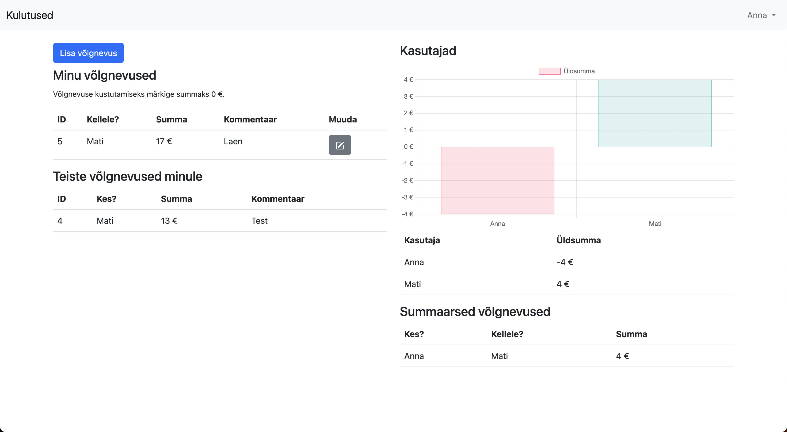

# Kulutused


Veebirakendus, millegi on võimalik arvet pidada, kes kellele kui palju raha võlgneb.

## Nõuded
Peavad olema installitud järgnevad programmid:
- Python (testitud 3.11-ga)
- Poetry
- SQLite *driver*
- Git

## Ülesseadmine

- Klooni GitHubi repositoorium: `git clone https://github.com/ks129/kulutused.git`
- Mine õigesse kataloogi: `cd kulutused`
- Paigalda vajalikud paketid: `poetry install`
- Konfigureeri `.env` failis:
```env
DEBUG=False/True    # False puhul Django admin näeb kole välja.
SECRET_KEY=<key>    # Genereerige <key> asemele suvalistest tähemärkidest koosnev jada.
```
- Loo andmebaas (SQLite): `poetry run task migrate`
- Loo esimene kasutaja: `poetry run python manage.py createsuperuser` ning seejärel sisesta soovitud andmed.
- Käivita veebiserver: `poetry run task start`
- Minge lehele http://localhost:8000 .
- Minge http://localhost:8000/admin , seal saata "Users" alla määrata enda ees- ja perekonnanime, lisaks luua uusi kasutajaid.
